# WRITEUP - Capture The Flag JNIC 2024


Equipo 	LastHeappiesDance (1/50)

- Isaac Lozano Osorio (isaac.lozano@urjc.es)
- Raúl Martín Santamaría (raul.martin@urjc.es)
- Sergio Pérez Peló (sergio.perez.pelo@urjc.es)


Enlace CTF: https://ctf.unex.es/ <br>
Enlace JNIC: https://2024.jnic.es/capture-the-flag/

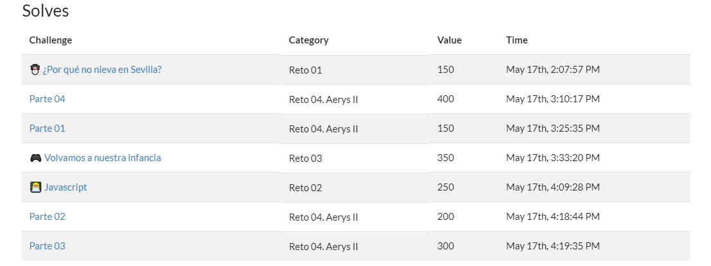


# Reto 1 - ☃️ ¿Por qué no nieva en Sevilla?


En este Reto nos encontramos 6 ficheros diferentes que no parecen tener ninguna extensión concreta:

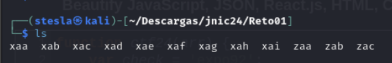

Si ejecutamos el comando file sobre todos los ficheros observamos que hay, al menos, un fichero zip y un fichero JPEG.

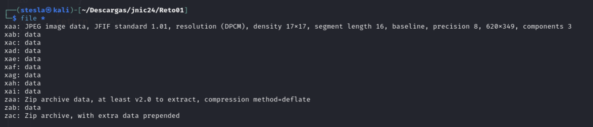

Como podemos observar, hay un patrón en los nombres de los ficheros, por lo que podemos intuir que, efectivamente, se trata de dos ficheros diferentes fragmentados: una imagen (ficheros xaa a xai) y un zip (ficheros zaa a zac). Procedemos a concatenar todos los ficheros para regenerarlos a su forma original:

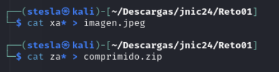

Y, efectivamente, recuperamos los ficheros originales:

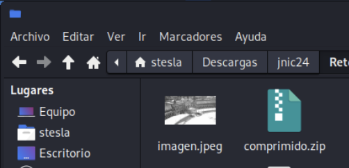

Si descomprimimos el fichero zip, vemos que dentro contiene otra imagen llamada snow.jpg. Analizando los metadatos de la imagen no encontramos nada extraño:

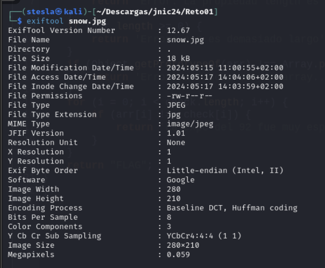

Sin embargo, lanzando el comando strings sobre la imagen, obtenemos una cadena sospechosa al final del fichero:

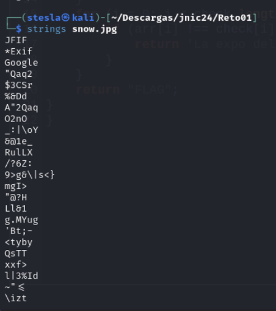
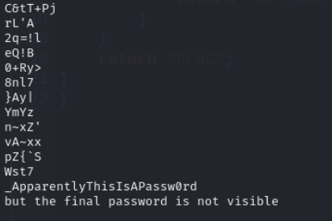

(Se ha omitido parte de la salida del comando strings para no aumentar la longitud del documento en exceso).

En este momento, dado que no hemos utilizado la imagen reconstruida para nada hasta el momento, podemos pensar que tiene algún tipo de información oculta mediante técnicas de esteganografía. Al haber obtenido una contraseña, la primera intuición es utilizar steghide para intentar extraer el contenido.

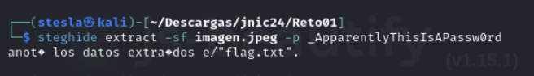

El comando tiene éxito y obtenemos un fichero llamado flag.txt. Sin embargo, a la hora de consultar su contenido, la flag no parece encontrarse dentro:

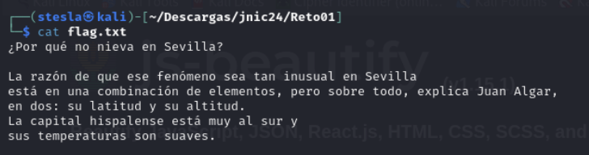

Sin embargo, tenemos varias pistas que nos llevan a pensar que hay información oculta también en este fichero:
- La imagen extraida del zip se llama "snow.jpg". Snow es una conocida herramienta para ocultar información en ficheros de texto utilizando los espacios.
- En las cadenas (strings) de la imagen previa se dice que "la password final no es visible".

Por lo tanto, aplicamos la herramienta stegsnow sobre el fichero flag.txt, obteniendo finalmente la flag para este reto:

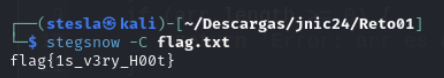

```flag{1s_v3ry_H00t}```
# Reto 2 - 👩🏼‍💻 Javascript

En este reto tenemos una función Javascript con el siguiente código:

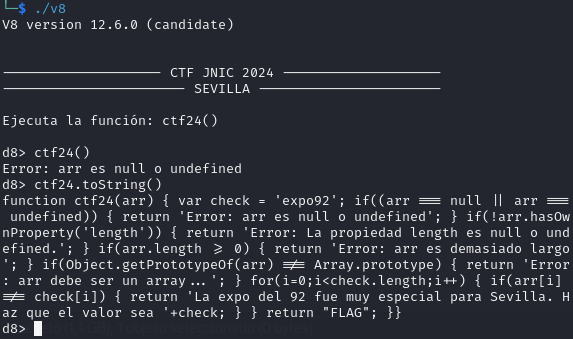

Bien formateado, el código es el siguiente:

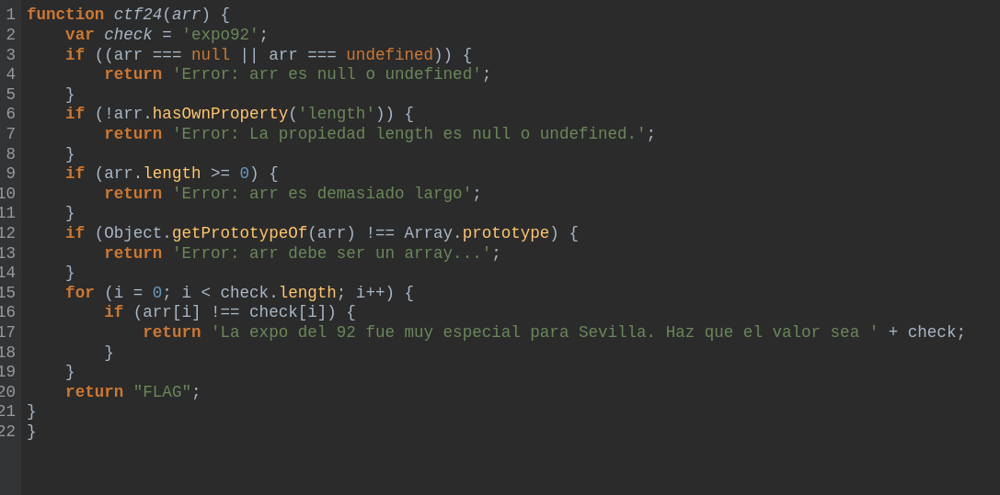

Para resolver el reto, necesitamos darle un argumento a la función algo que se parezca a un array, que tenga la secuencia de caracteres dentro "expo92", pero cuya longitud sea menor a 1. La función además comprueba el prototipo del objeto para ver si es un Array, por lo que parece imposible a priori.

Sin embargo, en Javascript es posible asignarle cualquier prototipo a un objeto, utilizando la propiedad mágica `__proto__`.
De esta forma, podemos crear un objeto que cumpla las restricciones pedidas, es decir, que se pueda acceder utilizando un número a las letras, y que además tenga longitud menor a 0:

```
fakearray = {
'0': 'e',
'1': 'x',
'2': 'p',
'3': 'o',
'4': '9',
'5': '2',
'length': -1
}
```

Y el último paso sería cambiarle el prototipo al objeto. 

```
fakearray.__proto__ = Array.prototype
```

Si camina como un pato, y habla como un pato... Obtenemos la flag:

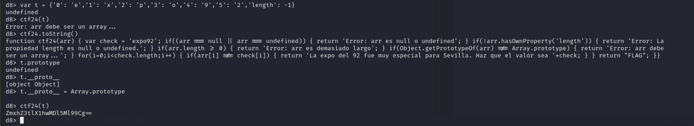

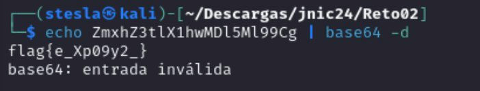

```flag{e_Xp09y2}```

# Reto 3 - 🎮 Volvamos a nuestra infancia

Herramientas necesarias: 
- Ghidra
- DeSmuME_0.9.13_x64
- Cheat Engine


En este reto tenemos un juego de la nintendo DS, que nos pide que pulsemos una serie de teclas. Suponemos que si acertamos la combinación, nos dará la flag.

Lo primero que hemos hecho es cargar el binario en GHidra utilizando el siguiente plugin: https://github.com/pedro-javierf/NTRGhidra

Buscando strings interesantes, hemos encontrado el String "Has ganado! aqui esta la flag"

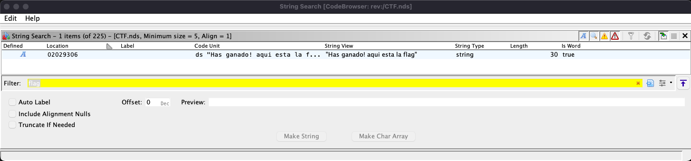

Por lo que inmediatamente vamos a ver donde se usa ese string.

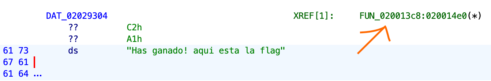

El decompilado no es demasiado útil, es muy difícil de entender y no se aprecia la funcionalidad. En el desensamblado, podemos observar que hace una comparación, y luego un branch, en las posiciones de memoria `20014c4-cc`

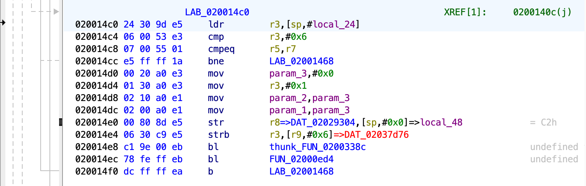

Con el emulador, comprobamos que al poner un breakpoint en esta posición de memoria, se para al comprobar si la secuencia introducida es correcta, por lo que parece la comprobación que valida si hemos acertado el código. Probamos simplemente a cambiar el compare equals (`cmpeq`, en `020014c8`) por compare not equals (`cmpne`). Reensamblamos y vemos que los bytes que cambian son los siguientes:

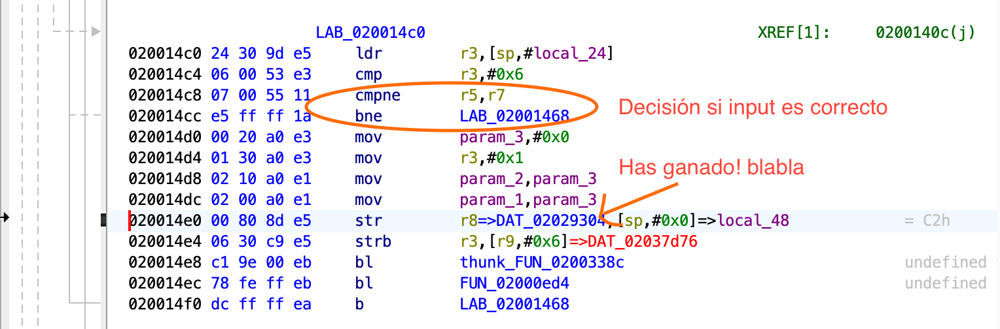

Es decir, tenemos que buscar
```
- 020014c8 07 00 55 01     cmpeq      r5,r7
- 020014cc e5 ff ff 1a     bne        LAB_02001468
```
y reemplazarlo por:
```
- 020014c8 07 00 55 11     cmpne      r5,r7
- 020014cc e5 ff ff 1a     bne        LAB_02001468
```
Lo cual haremos con Cheat Engine:

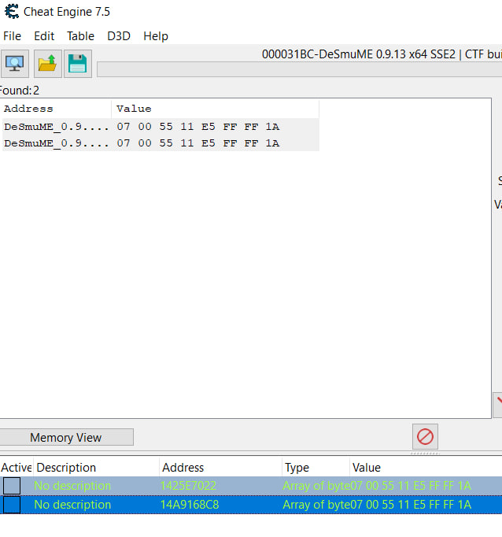

Y con esto obtenemos la flag enviando cualquier entrada.

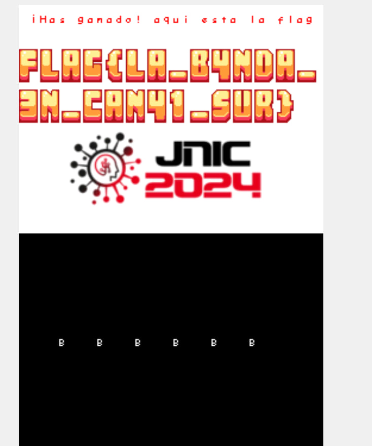

```flag{la_b4nda_3n_c4n41_sur}```
# Reto 4 - Aerys II

Herramientas: 
- nmap
- wfuzz
- OSINT 
Para este reto nos encontramos ante una máquina virtual que hay que vulnerar. Al iniciar la máquina se nos proporciona una IP para interactuar con ella:

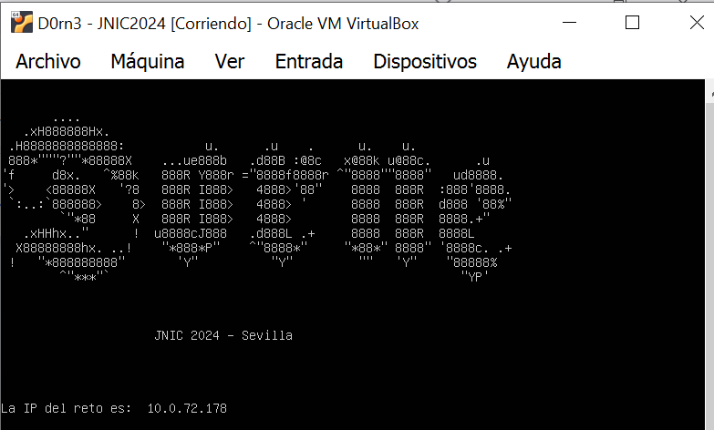

En nuestro caso es ```10.0.72.178```. Cuando nos conectamos a esta IP lo primero que vemos es el landing page de Apache.

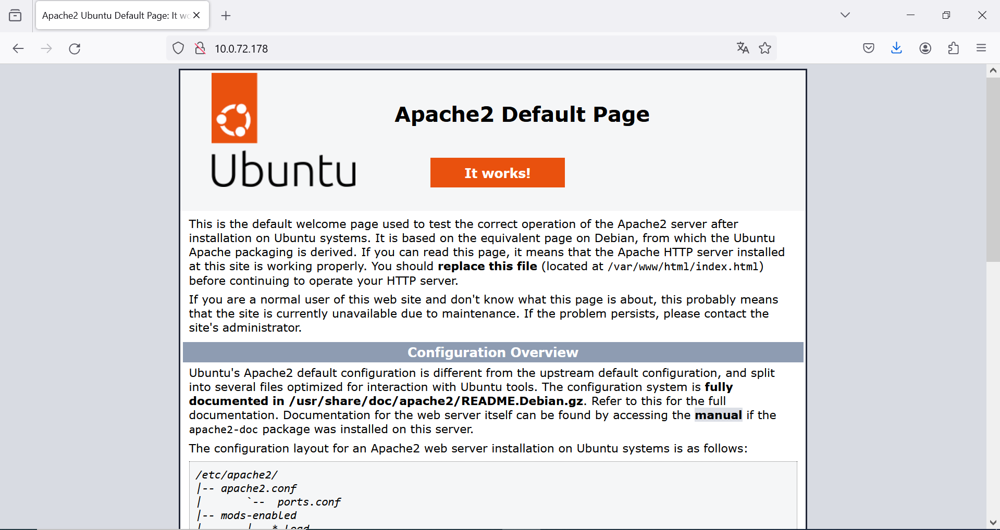

Antes de probar nada más, lanzamos un escáner de puertos con nmap para ver si hay algún puerto abierto al que debamos acceder, pero únicamente el puerto 80 y el 22 están en escucha:

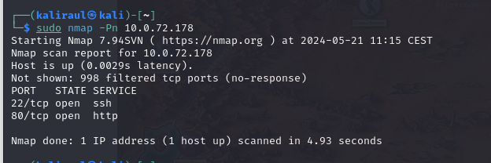

Probamos a acceder con los endpoint clásicos (index.html, index.php, etc.), resultando correcto el endpoint ```index.php```. 

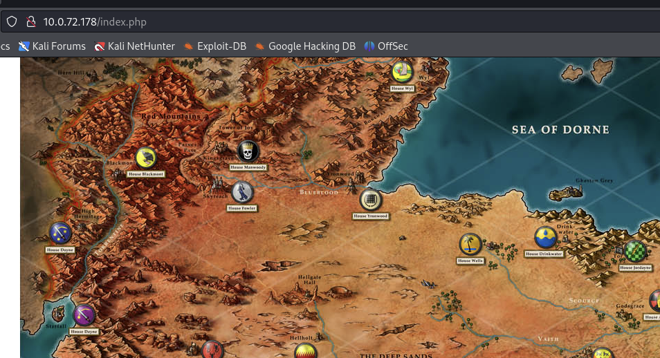

En este punto perdimos bastante tiempo intentando obtener algo de información de la imagen y haciendo fuzzing de endpoints con diferentes wordlists, hasta que utilizamos una wordlist con palabras y endpoints en castellano, que nos devolvió resultados interesantes:

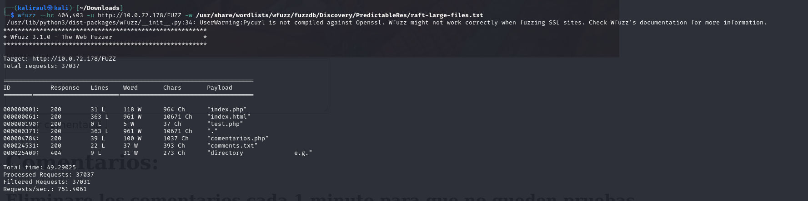

Como vemos, hay varios endpoints que devuelven un status code 200. El primero que llama nuestra atención es ```comentarios.php```. Viendo el código fuente de la página, podemos observar un comentario curioso:

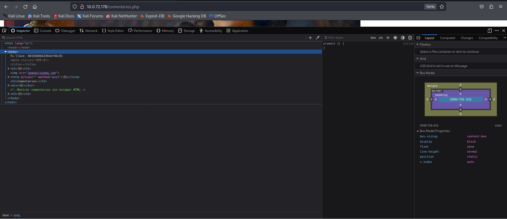

Se nos dice que el HTML de la caja de comentarios no será escapado, lo cual nos indica claramente la vulnerabilidad a explotar: Cross-Site Scripting (XSS). También hay un mensaje que especifica que cada minuto se borrarán los comentarios. Por lo tanto, sabemos que un usuario con privilegios para realizar esta acción (potencialmente, un admin), visitará la web que contendrá nuestro XSS almacenado. Además, vemos que el valor de "Tu llave:" se corresponde con el valor de la Cookie que se nos asocia al visitar el endpoint index.php. Lo que haremos será utilizar el sitio web [https://webhook.site/](https://webhook.site/) para recibir una petición que concatene la cookie del usuario admin como endpoint de la petición, obteniendo así su valor. Esta acción la realizaremos insertando un comentario en la web con el contenido que se muestra en la imagen:

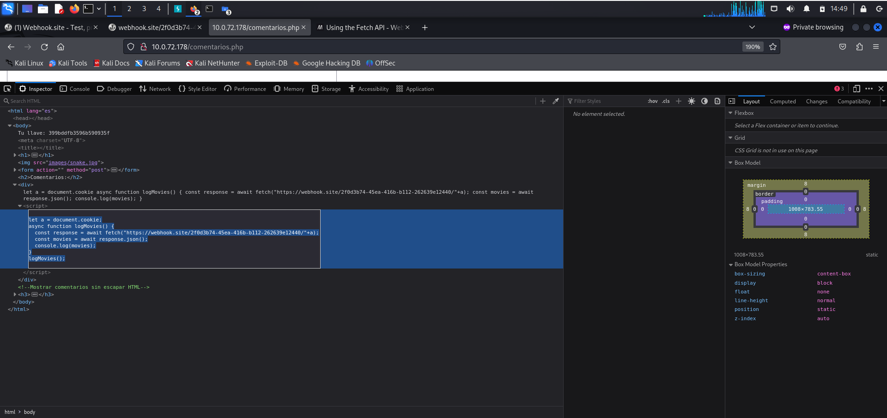

Tras unos instantes, comenzamos a recibir peticiones:

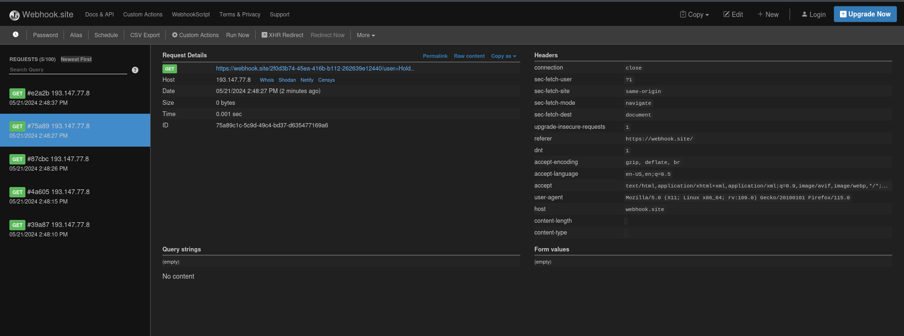

Hasta que finalmente recibimos la cookie del usuario administrador:

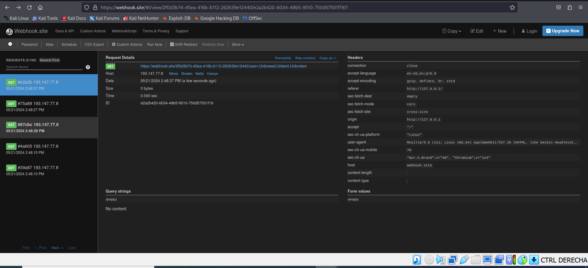

Añadimos la url que se indica en la web a nuestro fichero ```/etc/hosts```:

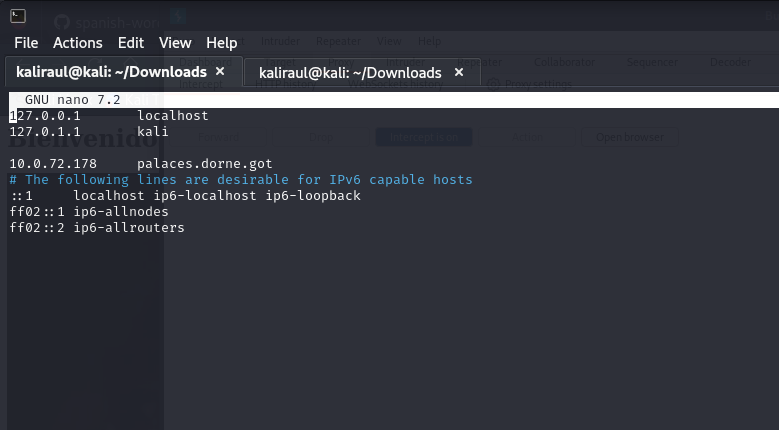

Y accedemos a la URL para chequear que todo está correctamente configurado:

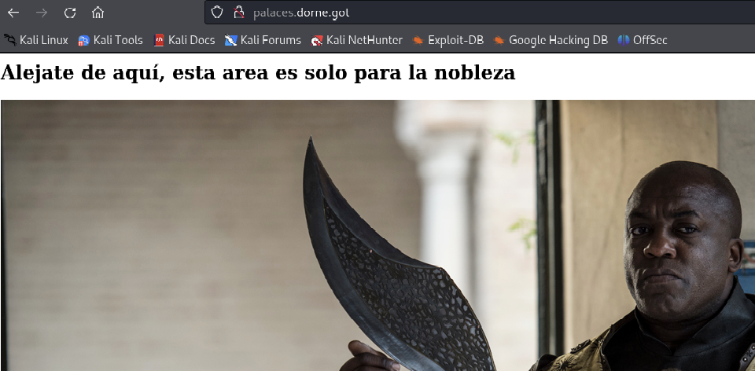

Como podemos observar, no tenemos permisos para acceder al contenido. Sin embargo, estableciendo la cookie de administrador que hemos recuperado previamente y refrescando la página, obtenemos la primera flag:

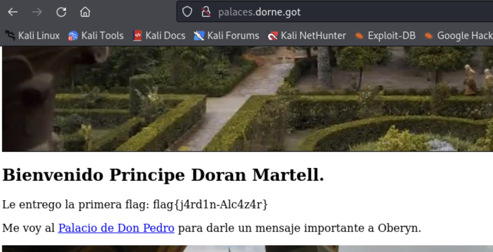


```flag{j4rd1n-Alc4z4r}```

A continuación observamos un nuevo nombre de dominio. De nuevo, lo añadimos a nuestro fichero ```/etc/hosts``` y lo visitamos. 

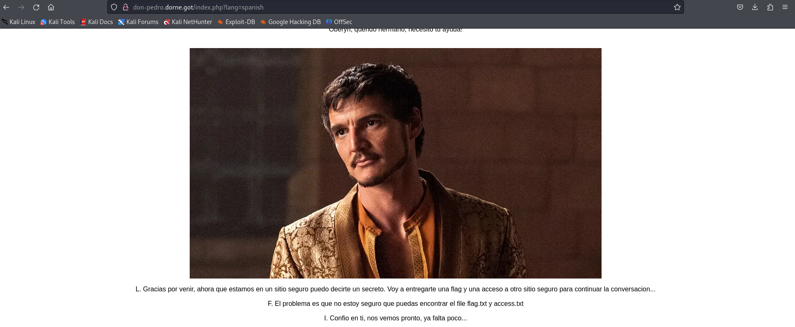

Al solicitar la versión en español de la página, vemos un mensaje curioso. En este mensaje es importante destacar tres detalles: las iniciales LFI en la conversación, que parecen indicar el camino hacia una vulnerabilidad de este tipo (Local File Inclusion); por otra parte, los nombres de los ficheros que debemos acceder: flag.txt y access.txt. Y un detalle del que inicialmente no nos dimos cuenta hasta obtener el parámetro requerido por otros medios: la palabra clave ```file```. Después de intentar inyecciones típicas a través del parámetro lang, y habiendo observado que probablemente se estuviese añadiendo algún tipo de extensión al nombre de fichero otorgado (dado que no pudimos obtener el fichero /etc/passwd), decidimos utilizar de nuevo la técnica de fuzzing, esta vez sobre los parámetros de la petición, y filtrando por tamaño. 

Sabiendo la longitud de la respuesta cuando el fichero accedido no es válido:


Simplemente filtramos aquellas peticiones que devuelvan una longitud diferente:

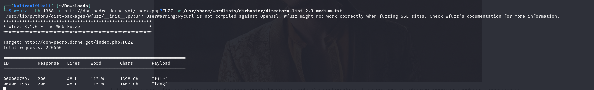

Obteniendo el parámetro file como parámetro correcto. Con este parámetro, recuperamos el fichero ```flag.txt``` obteniendo la segunda flag:

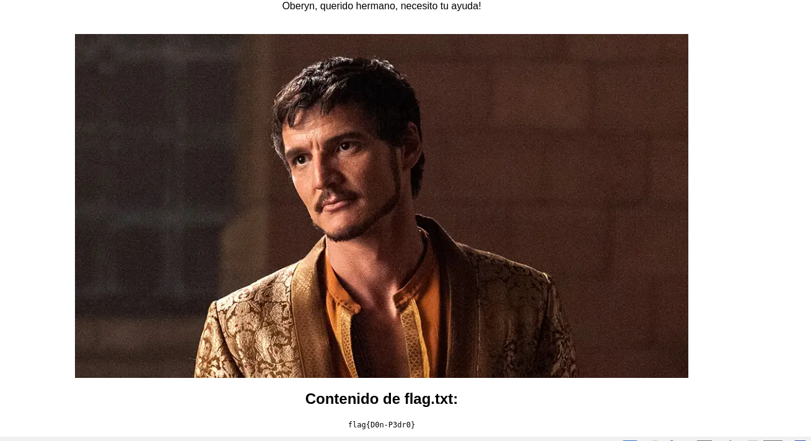

```flag{D0n-P3dr0}```

Accedemos ahora al otro fichero que se menciona, ```access.txt```. 

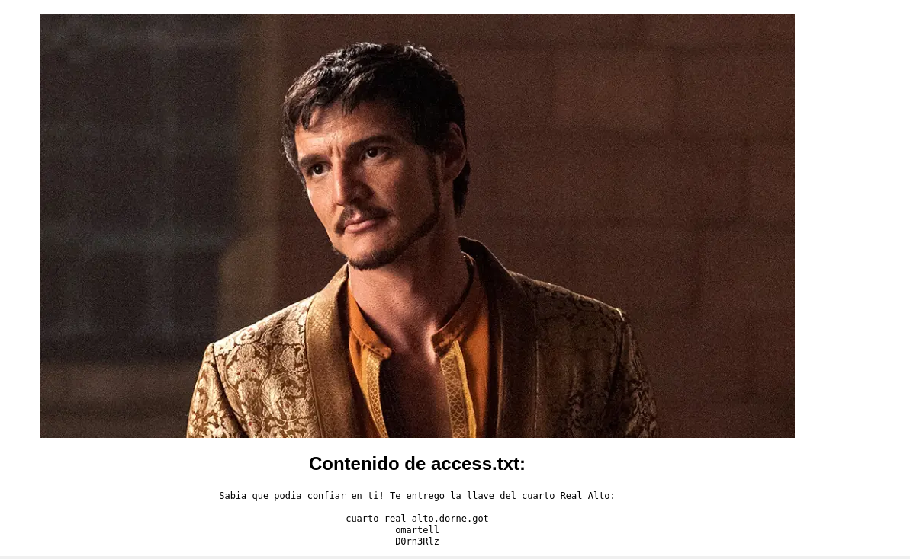

Como vemos, se nos proporciona otro dominio y unas credenciales. Añadimos este nuevo dominio a nuestro fichero ```/etc/hosts``` y accedemos con las credenciales proporcionadas. En este punto, se nos muestra un formulario para subir ficheros. La primera idea es subir una shell reversa, pero cuando intentamos acceder al fichero subido, no lo encontramos en ninguna ruta de la aplicación. Así que nos fijamos en el mensaje que aporta la página:


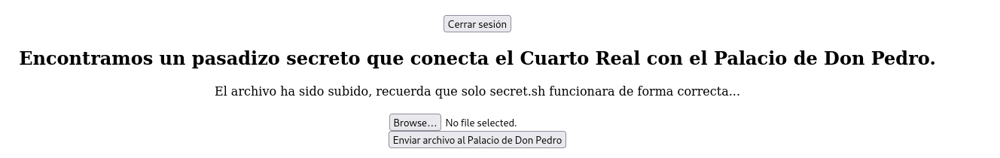

Se especifica que "solo secret.sh funcionara de forma correcta". Por lo tanto, lo que hacemos es subir un fichero .sh con una simple línea en bash para listar directorios y accedemos a él a través del parámetro file en el endpoint ```index.php``` del dominio ```don-pedro.doran.got```

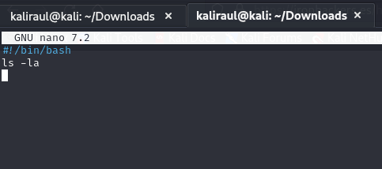

Y al acceder observamos que funciona correctamente:

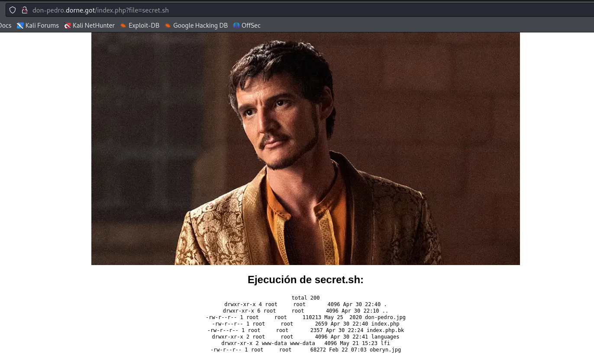

Una vez tenemos ejecución remota de comandos (RCE), hacemos una búsqueda de la cadena "flag{" utilizando el comando ```grep```. Repetimos el proceso de subida de secret.sh varias veces, buscando en el directorio actual (```./```), el superior al actual (```../```) y posteriormente en los directorios de usuario habituales (comenzando por ```/home```, resultando efectiva esta última consulta).

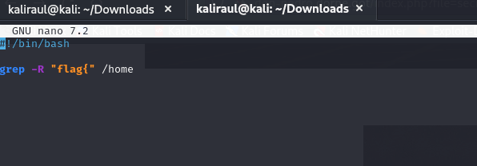

Obteniendo así la tercera flag:

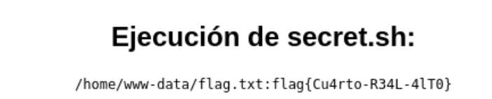

```flag{Cu4rto-R34L-4lT0}```


En este punto intentamos por activa y por pasiva lanzar una shell reversa hacia nuestra máquina que nos permitiera buscar vulnerabilidades en la máquina de manera sencilla, pero por cómo está configurado el adaptador de red de VirtualBox nos resulta imposible saber qué IP tiene nuestra máquina Kali de cara a la máquina del CTF. Por tanto, utilizando el mecanismo rudimentario de modificar el fichero ```secret.sh``` y resubirlo, lanzamos LinPEAS para saber si hay algún tipo de escalada de privilegios disponible (sabiendo que somos el usuario www-data al obtener la flag anterior). En la salida del script observamos una línea extraña:

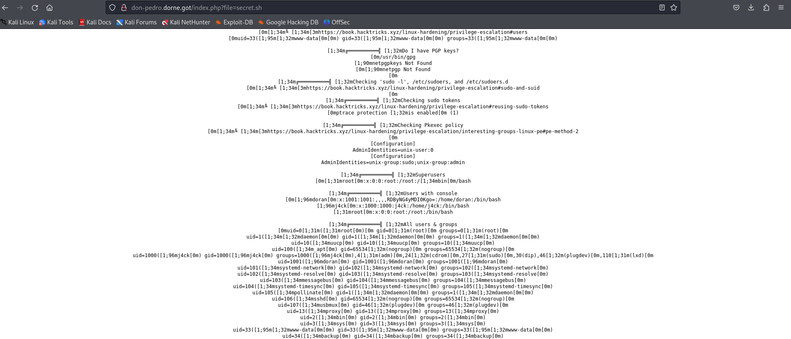

En concreto, en el apartado "Users with console" observamos un usuario conectado cuyo nombre es una cadena codificada en base64:

```
[1;34mm
÷ [1;32mUsers with console
[Om[1;96mdoran [Om:x: 1001:1001:,, ,,RDByNG4yMDI0Kgo=: /home/doran: /bin/bash
[1;96mj4ck [Om:x: 1000:1000:j4ck:/home/j4ck:/bin/bash
[1; 31mroot [0m: x: 0:0: root:/root:/bin/bash
```

Al decodificarla obtenemos la cadena: ```D0r4n2024*```. Probamos a acceder vía SSH a la máquina remota utilizando esta cadena como contraseña para el usuario doran y, con suerte, funciona:

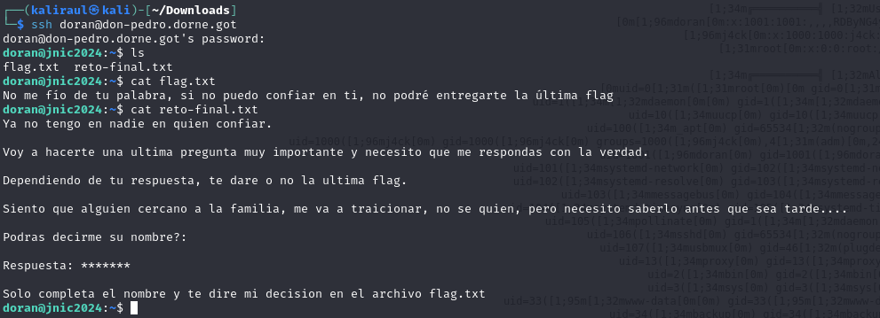

Observamos dos ficheros en el directorio ```home``` de este usuario. El fichero reto-final.txt parece requerir que se sustituyan los asteriscos por un nombre. En este punto, intentamos elevar privilegios o hacernos con el control del usuario j4ck sin éxito. En este punto, decidimos que quizá el último paso requiera simplemente de hacer un poco de OSINT, por lo que realizamos la búsqueda "Traicion dorne juego de tronos". 

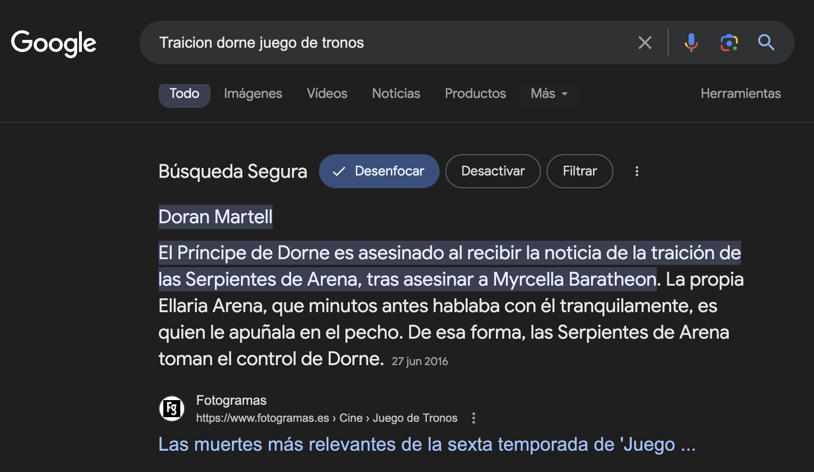

Por el contexto, entendemos que la respuesta correcta es Ellaria Arena. Eliminamos la cadena de asteriscos, la reemplazamos por Ellaria Arena y la modificación no parece tener éxito. Sin embargo, si cerramos la sesión SSH y volvemos a conectarnos, obtenemos la flag, completando así la máquina:

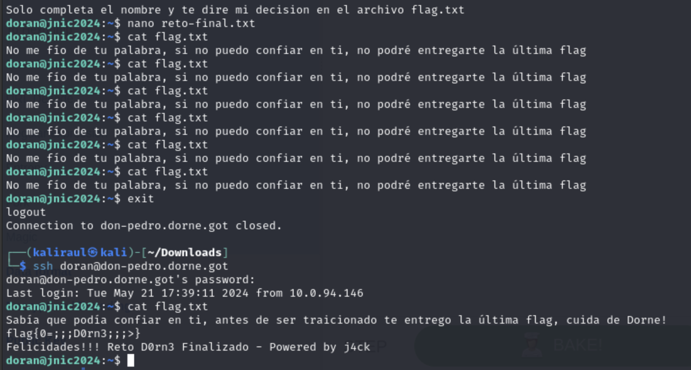

```flag{0=;;;D0rn3;;;>}```

Agradecemos a la organización el trabajo realizado y la oportunidad de poder disfrutar de estos retos. Sin duda, han sido enriquecedores y nos han hecho pasar un buen rato.


## Clasificación final

| **Place** |          **Team**         | **Score** |
|:---------:|:-------------------------:|:---------:|
| 	1	 	| 	**LastHeappiesDance**	 	| 	1800	| 
| 	2	 	| 	pipo	 				| 	1800	| 
| 	3	 	| 	ICAI Cyber Team	 		| 	1800	| 
| 	4	 	| 	Junk News In Cybersecurity (JNIC')	 | 	1800	 | 
| 	5	 	| 	The High Sleuths	 	| 	1800	 | 
| 	6	 	| 	We Trade Poultry	 	| 	1800	 | 
| 	7	 	| 	Ignition	 			| 	1800	 | 
| 	8	 	| 	Not0	 				| 	1800	 | 
| 	9	 	| 	APE, EPA, PAE	 		| 	1800	 | 
| 	10	 	| 	UciTeam1	 			| 	1800	 | 
| 	11	 	| 	CyberGen1_CU	 		| 	1800	 | 
| 	12	 	| 	Vitality_CherN00Byl	 	| 	1800	 | 
| 	13	 	| 	yeafqvsrggbvvvcrkf	 	| 	1650	 | 
| 	14	 	| 	?	 					| 	1450	 | 
| 	15	 	| 	H4ckt1v1st4s	 		| 	1450	 | 
| 	16	 	| 	Hacking Hooligans	 	| 	1450	 | 
| 	17	 	| 	Pym0nk3y	 			| 	1450	 | 
| 	18	 	| 	Kings	 				| 	1450	 | 
| 	19	 	| 	NovHack	 				| 	1450	 | 
| 	20	 	| 	CTF UCI Escorpiones	 	| 	1450	 | 
| 	21	 	| 	0N1C0D3RS	 			| 	1450	 | 
| 	22	 	| 	estamosdeexamenessintiempo	 | 	1300	 | 
| 	23	 	| 	r00ted	 				| 	1300	 | 
| 	24	 	| 	IKDOMU	 				| 	1050	 | 
| 	25	 	| 	Vigenère Team	 		| 	1050	 | 
| 	26	 	| 	alfa593	 				| 	1050	 | 
| 	27	 	| 	LUMAD	 				| 	1050	 | 
| 	28	 	| 	CryptoCrusaders2	 	| 	1050	 | 
| 	29	 	| 	UPCT4WIN	 			| 	1050	 | 
| 	30	 	| 	ALTF4	 				| 	700	 | 
| 	31	 	| 	42MLG	 				| 	400	 | 
| 	32	 	| 	ZIUR Gela	 			| 	400	 | 
| 	33	 	| 	0xACAb	 				| 	400	 | 
| 	34	 	| 	Flags N Roses	 		| 	400	 | 
| 	35	 	| 	C0n3ctad0sUCI	 		| 	400	 | 
| 	36	 	| 	H4ck3rt34m	 			| 	400	 | 
| 	37	 	| 	NoSafe Society	 		| 	400	 | 
| 	38	 	| 	Dracarius	 			| 	400	 | 
| 	39	 	| 	cargeees	 			| 	350	 | 
| 	40	 	| 	Kksolo	 				| 	350	 | 
| 	41	 	| 	CryptoCrusaders			| 	300	 | 
| 	42	 	| 	Ctrl+Alt+Defend	 		| 	250	 | 
| 	43	 	| 	WebOS	 				| 	250	 | 
| 	44	 	| 	KIKIBAR	 				| 	250	 | 
| 	45	 	| 	Team Powtes	 			| 	250	 | 
| 	46	 	| 	Hosteleridos	 		| 	250	 | 
| 	47	 	| 	P4u	 					| 	150	 | 
| 	48	 	| 	m4rkit	 				| 	150	 | 
| 	49	 	| 	LausDeo	 				| 	150	 | 
| 	50	 	| 	InfiltraDuo	 			| 	150	 | 
| 	51	 	| 	PwnOfPower	 			| 	150	 | 
